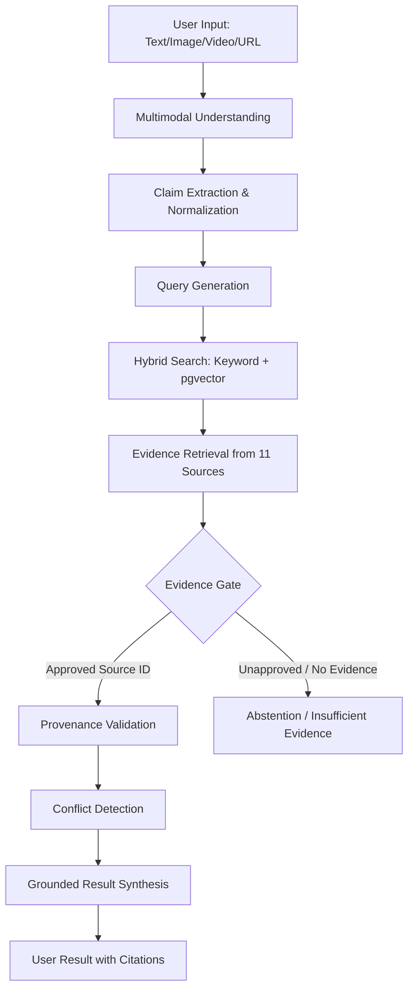
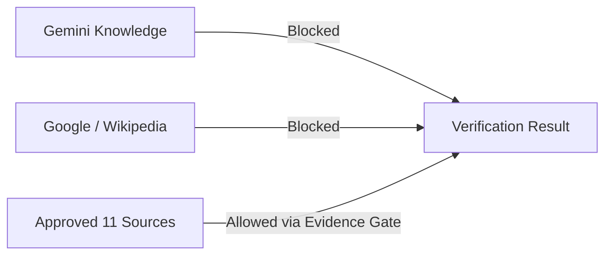

# بيّنة AI | BAYYINAH AI

**تحقّق قبل أن تنشر.**

Evidence-First Multimodal Islamic Content Verification Platform

> **لا نريدك أن تثق بالذكاء الاصطناعي؛ نريدك أن ترى المصدر بنفسك.**
> 
> **الذكاء الاصطناعي ليس مصدر الحقيقة الدينية.**

---

### What is Bayyinah AI?
Bayyinah AI is an evidence-bound, zero-hallucination verification engine for Islamic content. It processes text, images, videos, PDFs, and social media URLs to extract claims and rigorously verify them against a strictly defined allowlist of official Islamic sources.

Bayyinah AI is **NOT**:
- A generic chatbot
- An automated fatwa engine
- A religious authority
- A scholar replacement

### The Problem
* The rapid spread of unverified Islamic content, misquotes, and fabricated Hadiths on social media.
* The difficulty of quickly verifying text embedded in images, videos, and PDFs.
* The danger of relying on generative AI, which can hallucinate religious rulings or cite fabricated sources.
* Lack of traceability (provenance) to original, trusted Islamic scholarly platforms.

### Our Solution
A multimodal AI platform that extracts claims from any media format, but **completely disables the AI's ability to answer from its own knowledge**. Instead, it acts as a semantic bridge, querying 11 official Islamic databases and enforcing a strict **Evidence Gate** that rejects any claim not explicitly backed by an approved source.

### Core Principle
**Input → Claim Extraction → Verification → Evidence → Result**

Gemini is strictly used for *understanding* (Multimodal OCR, Transcripts, Claim Extraction). It is explicitly forbidden from serving as the *source of evidence*.

---

### How It Works

#### Why It Does Not Hallucinate Evidence

### Official Sources
The system searches *only* the following heavily vetted platforms. 

| Source Name | Domain |
|-------------|--------|
| Dawa Center | dawa.center |
| Islamic Content | islamic-content.com |
| Islamic Dictionary | islamic-content.com/dictionary |
| QuranPedia | quranpedia.net |
| Dorar Tafseer | dorar.net/tafseer |
| Dorar Hadith | dorar.net/hadith |
| Shamela | shamela.ws |
| Dorar Aqeeda | dorar.net/aqeeda |
| Dorar Feqhia | dorar.net/feqhia |
| Dorar History | dorar.net/history |
| Dawa Resources | dawa.center/file/7937 |

### Multimodal Verification
- **Text:** Direct semantic extraction.
- **Image:** Gemini Vision OCR → Claim Extraction → Verification.
- **Video:** Gemini Files API Transcript → Frame Analysis → Verification.
- **PDF:** Text Extraction → Chunking → Verification.
- **URL (TikTok/X):** Honest Capability Resolution (API fetch if authorized, else requires user upload).

### Verification States
The system returns one of the following strict states:
1. `VERIFIED` (ثابت بحسب المصدر)
2. `NOT_ESTABLISHED` (لم يثبت بهذا اللفظ)
3. `INSUFFICIENT_EVIDENCE` (لم نجد دليلًا كافيًا - System Abstention)
4. `CONFLICT` (اختلاف في المصادر)
5. `SPECIALIST_REVIEW` (يحتاج مراجعة مختص)
6. `WEAK` (ضعيف بحسب المصدر)
7. `FABRICATED` (موضوع/مكذوب بحسب المصدر)

### Technology Stack
- **Frontend:** React, Vite, TypeScript, TailwindCSS
- **Backend:** FastAPI, Python, Pydantic
- **AI Models:** Google Gemini 2.5 Flash / 3.8 Flash (Multimodal & Extraction), text-embedding-004
- **Database:** Supabase PostgreSQL with `pgvector` for Hybrid Search
- **Deployment:** Vercel (Multi-service Monorepo)

### Security & Limitations
Please read our detailed documentation:
- [Evaluation Guide](docs/EVALUATION.md)
- [Evidence Gate Logic](docs/EVIDENCE_GATE.md)
- [Security Policy](docs/SECURITY.md)
- [Deployment & Environment](docs/DEPLOYMENT.md)
- [Known Limitations](docs/LIMITATIONS.md)

### License
MIT License.
