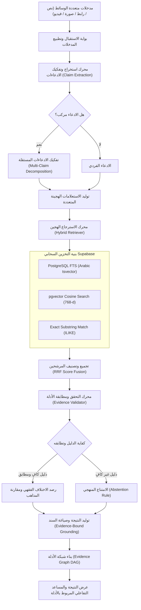
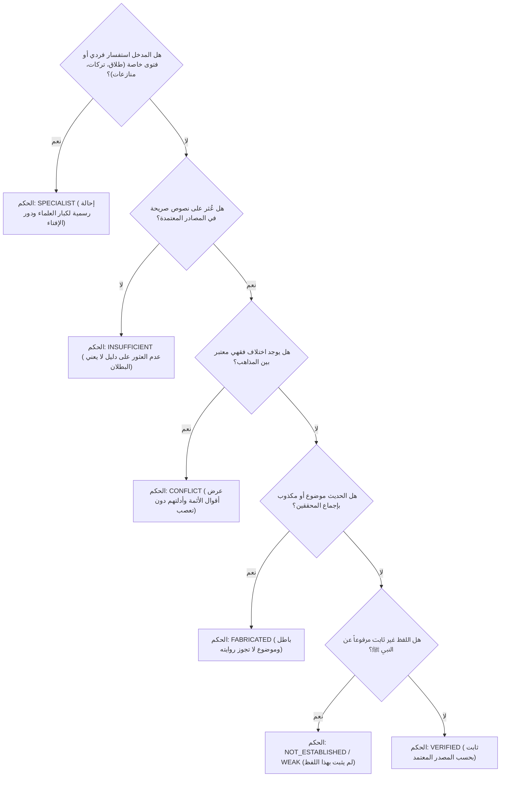

# معمارية بيّنة AI | System Architecture & Flow

> **الوثيقة المرجعية لمعمارية نظام بيّنة AI للتحقق من المحتوى الإسلامي الرقمي**

---

## 1. المبدأ الموجه (Core Engineering Principle)

تتبنى منصة **بيّنة AI** مبدأ هندسياً حاسماً:
$$\text{Evidence-First Deterministic Verification}$$
النظام مبني على قاعدة أن نماذج الذكاء الاصطناعي التوليدية (LLMs) ليست مصدراً للحقيقة، وتتعرض حتماً لظاهرة "الهلوسة" (Hallucination) عند توليد إجابات دينية مستقلة. لذا، تم حصر دور النموذج داخل مسارات محكومة بنصوص مسترجعة ومحققة مسبقاً، مع إلزامه بالامتناع التام عند عدم توفر الدليل الصريح.

---

## 2. المسار التنفيذي الشامل (End-to-End Pipeline)

---

## 3. محرك الاسترجاع الهجين وخوارزمية RRF (Hybrid Retrieval & Fusion)

لتحقيق أقصى درجات الدقة في رصد الألفاظ القرآنية والأحاديث النبوية، يدمج النظام ثلاثة مسارات متوازية:

1. **مسار المطابقة اللفظية التامة (Exact & Trigram Match):**
   يستخدم لتطابق المتون والآيات بدون أدنى تحريف بالاعتماد على الفهارس المباشرة.
2. **مسار البحث النصي المتقدم (PostgreSQL Arabic FTS):**
   يعتمد على تهيئة القاموس العربي `to_tsvector('arabic', content)` و`ts_rank_cd` لمعالجة الجذور والسوابق واللواحق في الكلمات العربية.
3. **مسار البحث الدلالي المتجهي (pgvector Semantic Search):**
   يستخدم متجهات 768 بعداً مستخرجة من النموذج الرسمي `models/gemini-embedding-001` مع قياس التشابه عبر معامل جيب التمام:
   $$\text{Similarity} = 1 - (\vec{u} \cdot \vec{v})$$

### خوارزمية الدمج التبادلي (Reciprocal Rank Fusion - RRF):
يتم احتساب النتيجة النهائية لكل قطعة نصية مسترجعة عبر الصيغة:
$$\text{RRF Score}(d) = \sum_{m \in \text{Channels}} w_m \times \frac{1}{k + \text{Rank}_m(d)}$$
حيث:
- $k = 60$ (معامل الاستقرار المعياري).
- $w_{\text{exact}} = 1.5$ (ترجيح المطابقة الدقيقة).
- $w_{\text{fts}} = 1.2$ (ترجيح الفهرسة النصية).
- $w_{\text{vector}} = 1.0$ (ترجيح المتجه الدلالي).

---

## 4. شجرة قرار الامتناع والضبط المنهجي (Abstention Decision Tree)

تطبق المنصة قاعدة الامتناع الصارم المستمدة من المعايير الرسمية:

---

## 5. شبكة الأدلة الترابطية (Interactive Evidence Graph Architecture)

لتحويل عملية التحقق من "صندوق أسود" إلى مسار شفاف بالكامل، يُنشئ النظام شبكة DAG (Directed Acyclic Graph) تعكس شجرة الاستدلال الكاملة:

$$\text{Session Node} \longrightarrow \text{Claim Nodes} \longrightarrow \text{Source Nodes} \longrightarrow \text{Evidence Chunk Nodes} \longrightarrow \text{Final Result Node}$$

تتيح الواجهة للمستخدم والحكام النقر على أي عقدة لاستعراض:
- رقم الباب والصفحة أو رقم الحديث.
- بصمة المحتوى (SHA-256 Content Hash).
- درجات التطابق (Exact, FTS, Vector, RRF).
- الرابط الرسمي المباشر للمصدر المعتمد.

---

## 6. معمارية المحادثة الموجهة بالأدلة (Evidence-Bound Chat)

في جلسات المحادثة والاستفسار حول نتائج التحقق (`/api/chat/{session_id}`):
- يُمنع المساعد منعاً باتاً من الإجابة من خارج سياق الأدلة المسترجعة للادعاء.
- يتم ربط كل رسالة مولدة بجدول `chat_evidence_bindings` في قاعدة بيانات Supabase.
- إذا وجه المستخدم سؤالاً خارج الأدلة المسترجعة، يمتنع المساعد فوراً:
  > *"أنا مقيد حصراً بالأدلة الموثقة المسترجعة لهذا الادعاء من المصادر المعتمدة، ولا يمكنني تقديم إجابات خارج هذه الحدود."*
