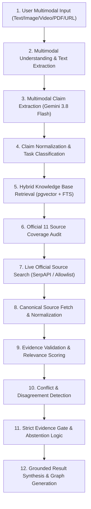

# Verification Pipeline Architecture | مسار التحقق العلمي في بيّنة AI

## Overview (نظرة عامة)

Every input provided to **Bayyinah AI**—whether text, image, video, PDF document, or social URL (TikTok, X, YouTube)—passes through a single, unified, deterministic, and evidence-first verification pipeline.

$$\text{Input} \xrightarrow{\text{Multimodal}} \text{Content Extraction} \xrightarrow{\text{AI}} \text{Claim Extraction} \xrightarrow{\text{Normalization}} \text{Canonical Claim} \xrightarrow{\text{Orchestrator}} \text{11 Official Sources} \xrightarrow{\text{Gate}} \text{Validated Result}$$

---

## The 12-Step Verification Pipeline

---

## Detailed Step Description

### Step 1: Multimodal Ingestion
Accepts inputs across standard formats:
- **Text**: Direct Arabic or English query string.
- **Image**: PNG, JPG, WEBP formats processed via Gemini 3.8 Flash OCR with Tesseract fallback.
- **Video**: MP4, MOV uploaded via Gemini Files API for temporal keyframe and transcript extraction.
- **PDF**: Document parsing via PyPDF2 / pdfplumber.
- **URL**: TikTok (`v2/oembed`), X (`2/tweets`), YouTube (`v3/captions`), or generic web link behind SSRF protection.

### Step 2: Content Extraction & Disambiguation
Extracts raw text, OCR transcripts, keyframe captions, or audio transcripts into a structured `extracted_text` payload.

### Step 3: Multi-Claim Extraction
Parses complex content into isolated atomic claims. Each claim is analyzed for:
- Claim Text & Type (`HADITH`, `TAFSEER`, `FATWA`, `HISTORICAL`, `GENERAL_ISLAMIC`)
- Target Verification Scope (Level A, B, C, D)
- Risk Level (`LOW`, `MEDIUM`, `HIGH`, `CRITICAL`)

### Step 4: Claim Normalization
Applies Arabic normalizers:
- Tashkeel stripping (`حَرَكَتْ` $\rightarrow$ `حركت`)
- Tatweel stripping (`مـــــحمد` $\rightarrow$ `محمد`)
- Alef/Yaa/Taa Marbouta unification (`أ/إ/آ` $\rightarrow$ `ا`, `ى` $\rightarrow$ `ي`, `ة` $\rightarrow$ `ه`)

### Step 5: Hybrid Knowledge Base Search
Queries PostgreSQL via Supabase:
- **Vector Search**: 768-dimensional embeddings computed via `text-embedding-004`, evaluated with Cosine Distance (`<=>`).
- **Full-Text Search (FTS)**: Arabic dictionary `tsvector` with `ts_rank_cd`.
- **Reciprocal Rank Fusion (RRF)**: Merges dense vector and sparse FTS results deterministically.

### Step 6 & 7: Official 11 Source Coverage & Live Search
Every claim triggers `SourceCoverageOrchestrator` to audit coverage across all 11 official sources:
1. `dawa.center`
2. `islamic-content.com`
3. `quranpedia.net`
4. `dorar.net/tafseer`
5. `dorar.net/hadith`
6. `shamela.ws`
7. `dorar.net/aqeeda`
8. `dorar.net/feqhia`
9. `dorar.net/history`
10. `dawa.center/file/7937`
11. `islamic-content.com/dictionary`

If local indexes lack sufficient depth for any official source, a targeted query is executed against official domains via live API search (`SerpAPI / Google Search API`).

### Step 8: Canonical Source Resolution
Ensures all web citations resolve directly to official domain endpoints (e.g. `https://dorar.net/hadith/sharh/...`). No unverified blog posts or forums are accepted as canonical evidence.

### Step 9: Evidence Validation
Evaluates retrieved text chunks using `CitationValidator` against exact text matching, semantic relevance ($\ge 0.70$), and source authority level.

### Step 10: Disagreement & Conflict Detection
Identifies legitimate juristic differences among the four Sunni Madhhabs (Hanafi, Maliki, Shafi'i, Hanbali). If conflicting authentic opinions exist, the claim is flagged as `CONFLICT` (Level B) rather than prematurely marked false or true.

### Step 11: Evidence Gate & Abstention Rules
If total evidence score $< 0.65$ or no match is found across official sources:
- Status is set to `UNVERIFIED` / `INSUFFICIENT_EVIDENCE`.
- system output includes explicit abstention note: *"عدم العثور على دليل في المصادر المعتمدة لا يعني إثبات البطلان، وإنما يعني عدم ثبوت الادعاء في حدود ما تم فحصه."*
- If the claim is a personal fatwa / novel jurisprudence (Level C), system returns `SPECIALIST_REQUIRED`.

### Step 12: Grounded Result & Interactive Evidence Graph
Renders the complete verification verdict, confidence score, evidence cards, canonical links, and an interactive DAG network graph (`EvidenceGraph.tsx`).
